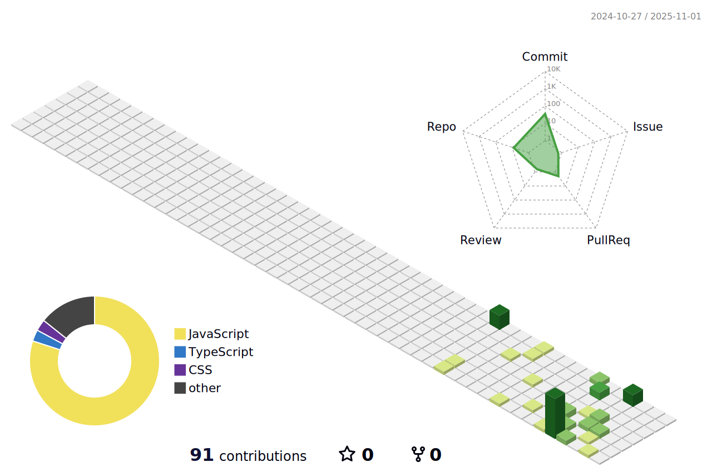

<!--  -->
<!--  -->

### Hi there, this is Guanyu 👋

 

🎓 UT Alumni

👨‍🎓 Master student 

  
Previous works 

  <ul>
    <li><a href="https://guanyu-zhang.github.io/audio_sensing_blog/">Audio Sensing</a></li>
    <li><a href="https://medium.com/@bbouslog/iwildcam-2020-trail-camera-animal-classification-2535a23cebae">Undergrad Term Project on iWildCam2020</a></li>
    <li><a href="https://github.com/guanyu-zhang/tweet_vid_downloader/blob/master/README.md">A script to download twitter videos</a></li>
  </ul>

